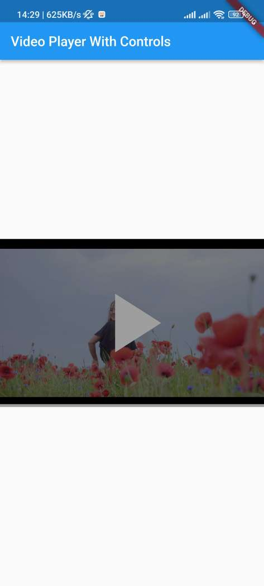
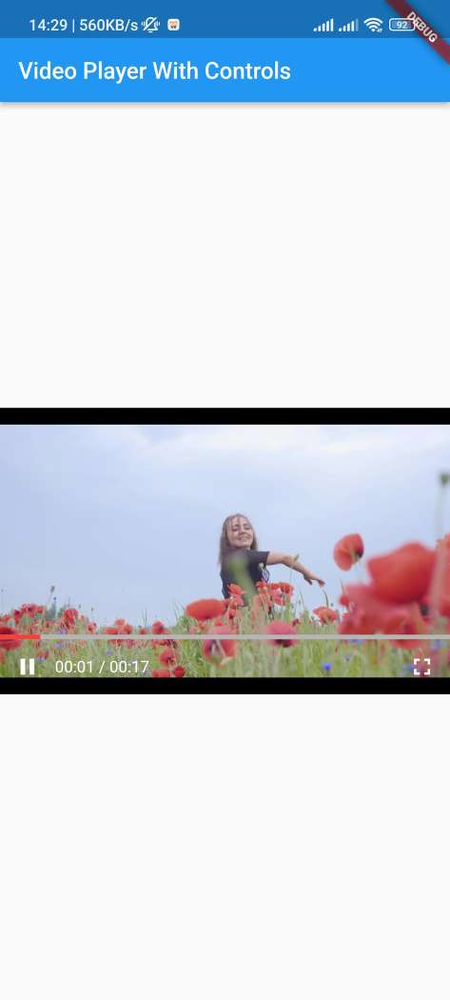
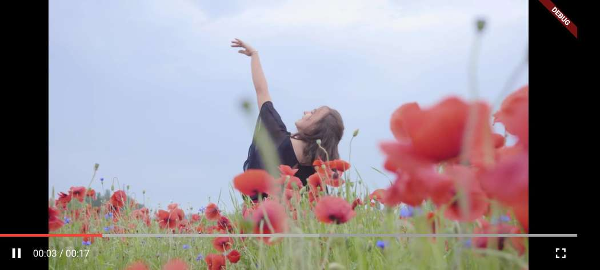

# video_player_with_controls


`video_player_with_controls` is a Dart package that provides an enhanced video player with additional controls and features for Flutter applications.

## Features

- Play/Pause functionality
- Display of video played duration and total duration
- Fullscreen support
- Automatic hiding of controls after 3 seconds of inactivity
- Customizable skip functionality to move forward or backward by a specified number of seconds

## Screenshots





## Usage

To use this package, add `video_player_with_controls` as a dependency in your `pubspec.yaml` file.

```yaml
dependencies:
  video_player_with_controls: ^1.0.0
```

Import the package in your Dart code.

```dart
import 'package:video_player_with_controls/video_player_with_controls.dart';

```

Then add the code snippet below

```dart
@override
  Widget build(BuildContext context) {
    return Scaffold(
      appBar: AppBar(
        title: Text('https://assets.mixkit.co/videos/preview/mixkit-girl-dancing-happily-in-a-field-of-flowers-4702-large.mp4'),
      ),
      body: Center(
        child: SizedBox(
          height: 250.0,
          child: VideoPlayerWithControls(
            videoUrl: videoPlayUrl,
            skipVideoUptoSec: 8
          ),
        )
      )
    );
  }
  ```

  Hope you enjoy!!!